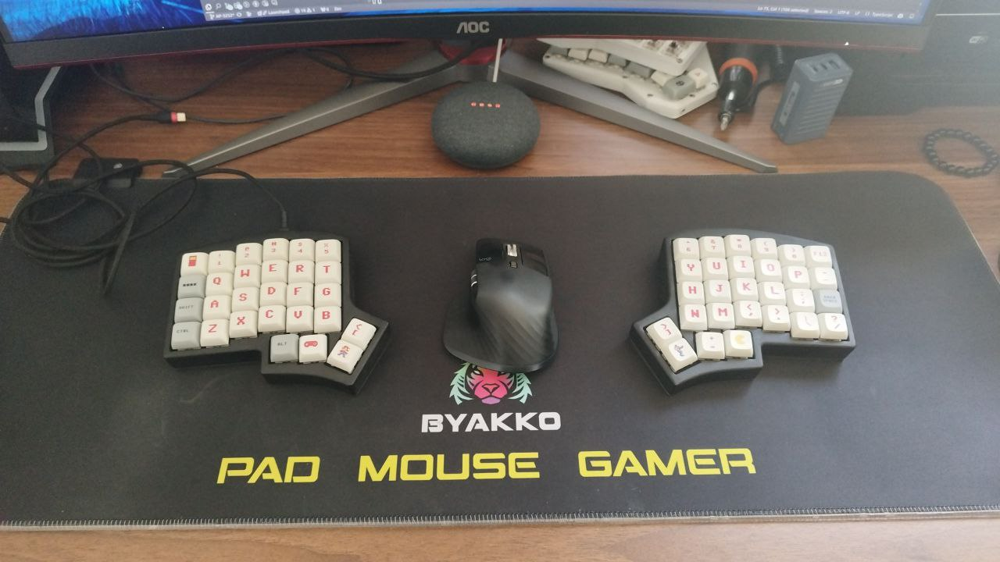

## Kimera-Irisly

The Kimera-Irisly is an Iris handwired wireless split keyboard, but named different because it uses the lily58 zmk firmware with a pair of generic nice-nano (the Supermini nRF52840).

The initial idea was to use just the Iris settings, but it was not successful, so basically it is a lily58 in an Iris body just like Nina Tucker =|

It was heavily inspired by the Schplit keyboard from larryare [Link to zmk-config-schplit](https://github.com/larryare/zmk-config-schplit).

And all the configs were made using the ZMK keymap editor from nickcoutsos [Link to keymap-editor](https://nickcoutsos.github.io/keymap-editor/).

# Items 
1. Fake Holy panda (it surprised me.. the feel is better than my gateron brown from another keyboard) [Link to purchase](https://a.aliexpress.com/_mOVAt7A)
2. NRF52840 (nice nano compatible.. brought some for arduino and home assistant stuff) it costs $10 for the pair on aliexpress too, but the link is down now
3. Some 1N4148 diods
4. The body 3d printed from thingverse (the stl files are on the assets folder too, just in case...)

# Considerations...
1) Yeah... it is wireless but I'm too lazy to plug and unplug the cable until my keymap is complete.
2) I'm not a 3D modeling guy... so I just got the files from https://www.thingiverse.com/thing:3186129 and cut them according to my needs. At first, I thought the battery would fit in there, but no, it doesn't.
3) Please ignore the Pad Mouse Gamer... I'm not a gamer at all, it was just the cheapest mouse pad that I found.
4) This is just a DIY keyboard from a guy who has another 100 unfinished projects.